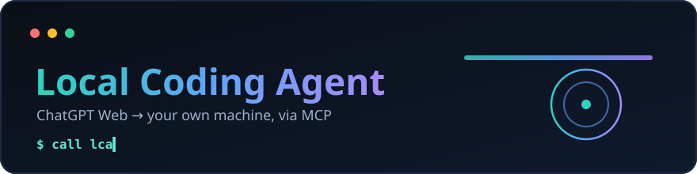

<div align="center">



# Local Coding Agent

Local MCP server giúp ChatGPT Web đọc/sửa code, chạy command và xem git trên máy bạn. Mục tiêu là biến ChatGPT thành coding agent làm việc trực tiếp trên workspace local, nhưng vẫn giữ quyền kiểm soát ở phía bạn.

LCA được thiết kế như một **managed coding execution runtime**: model ChatGPT mạnh chịu trách nhiệm suy luận và quyết định; LCA cung cấp repo context, task isolation, journaled mutation, Review Changes, tiến trình, Undo/Reapply và durable history. LCA không cố trở thành một autonomous agent có model riêng.

</div>

> Công cụ này có thể chạy command trên máy bạn. Chỉ dùng với repo tin tưởng.
> Đây không phải OS sandbox. Đọc thêm [SECURITY.md](SECURITY.md).

## Mục Tiêu Thiết Kế

Một task LCA không được tối ưu thành thao tác “đọc rồi ghi file” không có quản trị. Dù task nhỏ, mutation vẫn phải thuộc một task đã mở, gắn đúng workspace, được journal hóa, review được và có thể Undo/Reapply khi snapshot cho phép.

Workflow tối thiểu có chủ ý:

```text
pin workspace → mở task/baseline → lấy evidence cần thiết
→ journaled mutation → review diff → đóng task/history
```

Tốc độ được tối ưu bằng cách cache discovery theo catalog hash, dùng adaptive Memory đúng profile, batch evidence/mutation, baseline summary, journal prewarm, read coalescing, review theo mutation epoch và payload compact; không cắt bỏ task boundary, journal, progress, review hay history. Verification vẫn theo scope và chỉ chạy khi user yêu cầu trực tiếp.

Task completion được biểu diễn theo ba trục độc lập: execution, verification và integrity. Công việc đã hoàn thành mà user không yêu cầu test được ghi là `completed / not_requested / clean`, không còn bị hạ thành `incomplete`. Khi verification được yêu cầu và đặt `required`, evidence thiếu, stale hoặc fail vẫn chặn complete close.

Vì reasoning nằm ở ChatGPT, LCA nên được đánh giá như execution backend có quản trị: task completion, độ chính xác context, isolation, journal/Undo/Reapply, observability, reliability và round-trip efficiency. Việc LCA không sở hữu model/planner tự trị là lựa chọn kiến trúc, không phải thiếu sót về autonomous intelligence.

## Cài Nhanh

Bạn chỉ cần làm 3 bước:

1. Chạy setup wizard trong repo `local-coding-agent`.
2. Vào repo muốn làm việc và chạy `lca`.
3. Thêm custom MCP connector trong ChatGPT Web.

Yêu cầu:

- Node.js >= 22.13.0
- npm
- Git, khuyên dùng để `lca` tự lấy git root làm workspace
- OpenAI Tunnel ID và Runtime API key nếu dùng ChatGPT Web tunnel

Chạy setup wizard:

```bash
# macOS / Linux / WSL
bash scripts/lca setup
```

```powershell
# Windows
scripts\lca.cmd setup
```

Wizard sẽ tự detect hệ điều hành hiện tại, kiểm tra prerequisite, mở trang tạo Tunnel/API key, tạo/cập nhật `.env.local`, cài dependency trong `server/`, tải `tools/tunnel-client`, ghi config local và cài global command `lca`. Trên Windows, wizard sẽ thêm thư mục `lca.cmd` vào User PATH; mở terminal mới trước khi gõ `lca`.

Workspace khởi động của wizard mặc định luôn là chính repo `local-coding-agent`, không phụ thuộc thư mục hiện tại hoặc config cũ. Chỉ dùng `--workspace <path>` nếu chủ động muốn ghi đè. Sau lần cài đầu, chạy lại bằng `lca setup` có cùng hành vi với `bash scripts/lca setup`.

Nếu cần xem hướng dẫn cho hệ điều hành khác máy đang chạy, dùng `node scripts/local-coding-agent.mjs setup --choose-os`.

## Dùng Hằng Ngày

Mỗi lần muốn ChatGPT bắt đầu task mới trên repo nào, hãy mở terminal tại repo đó rồi chạy `lca`. LCA sẽ tự nhận git root, đăng ký workspace tin tưởng và chọn nó làm workspace mặc định cho task tiếp theo.

Trên Windows, mở terminal mới sau setup rồi chạy:

```powershell
cd /d <path-to-your-repo>
lca
```

macOS/Linux:

```bash
cd /path/to/your-repo
lca
```

runtime chỉ có một supervisor sở hữu server và tunnel. Chuyển workspace không restart hai process này và không đổi workspace của task đang chạy. Hai chat có thể mở hai task trên hai repo khác nhau cùng lúc.

Lệnh chính:

```bash
lca           # đăng ký/chọn repo hiện tại cho task mới; start supervisor nếu cần
lca stop      # dừng server + tunnel
lca status    # xem supervisor, connector, session, task và workspace
lca workspace # mở TUI chọn workspace cho task mới
lca workspace list
lca workspace use /path/to/repo
lca workspace archive <path|workspace-id> # tạm ẩn, giữ ID/task/history
lca workspace restore <path|workspace-id> # khôi phục workspace đã archive
lca workspace rebind <path|workspace-id>  # xác nhận lại identity sau khi volume/repo thực sự đổi
lca workspace remove <path|workspace-id>  # xóa vĩnh viễn dữ liệu LCA, không xóa source repo
lca config    # mở TUI cấu hình mode/policy/workspace/port
lca doctor    # kiểm tra cấu hình local
lca update    # backup config/existing runtime state và nâng cấp an toàn
lca rollback  # quay lại release trước, giữ nguyên dữ liệu runtime
```

Kiểm tra local:

```text
lca status
http://127.0.0.1:8789/healthz
```

`/healthz` chỉ trả liveness/version/catalog và không lộ workspace, PID hay cấu hình. Thông tin chi tiết nằm ở `lca status`; endpoint nội bộ `/healthz/details` dành cho CLI/extension local và yêu cầu instance nonce do supervisor cấp. Bearer của tunnel không có quyền companion/control-plane.

## Tích Hợp ChatGPT Web

Chi tiết: [docs/CHATGPT_WEB_CONNECTOR.md](docs/CHATGPT_WEB_CONNECTOR.md).

Tóm tắt:

1. Chạy `lca setup`.
2. Vào repo cần làm việc, chạy `lca`.
3. Mở ChatGPT Web.
4. Settings -> Connectors -> Developer mode -> Add custom MCP connector.
5. Chọn tunnel đã tạo.
6. Auth: chọn `No auth`.
7. Lưu connector.
8. Trong ChatGPT, hỏi `call lca`; prompt ngắn này được định tuyến tới `lca_status` để kiểm tra runtime, task và workspace.

Runtime API key nằm ở `.env.local` và chỉ dùng cho local tunnel-client. Không nhập Runtime API key vào phần auth của ChatGPT connector.

## ChatGPT Tools

runtime có catalog cố định 34 tool. Sau khi connector hoạt động, hai entry point thường dùng là:

```text
lca_status # mặc định cho `lca` / `call lca`; kiểm tra runtime, catalog, workspace/task và output limits
lca_input  # chỉ mở Apps SDK widget khi yêu cầu rõ widget/composer/PiP
```

`lca_status` trả `catalog_version=17` và `catalog_hash`. Khi catalog thay đổi, hãy refresh connector một lần và mở chat mới; tên tool cũ không còn callable và client stale sẽ nhận lỗi kèm hướng dẫn refresh.

Mỗi tool có exact `discovery-group:*` tags để dynamic discovery nạp một nhóm workflow trong một lần. App-level instructions chỉ công bố prefix và label tách rời để query nhóm không match nhầm toàn catalog. ChatGPT không nên tự nghĩ query như `write`/`edit`, gọi catalog không có query, hoặc fallback sang toàn bộ 34 tool khi group bị thiếu.

Trước khi dùng tool đọc/sửa/chạy code trong chat mới, gọi `workspace_list`, truyền `selected_workspace_id` vào `task_open.primary_workspace_id`, rồi giữ `conversation_workspace_token` trả về cho mọi task tiếp theo trong cùng chat. `workspace_select` chỉ đổi workspace mặc định cho conversation tương lai; nó không phải bước bắt buộc trước task hiện tại. `title` là nhãn UI ngắn. `objective` là metadata tùy chọn, bền vững và hiển thị cho user về kết quả cần đạt cùng constraint riêng của task; không dùng nó làm private reasoning, nơi chứa secret hoặc policy chung. Chỉ truyền title thì objective giữ `null`; thiếu title có thể sinh title từ objective. ChatGPT chọn `complexity_hint` là `quick_edit`, `normal` hoặc `complex`; nếu bỏ qua, runtime dùng `normal`. `memory_mode` mặc định là `auto`: quick edit dùng light Memory theo `relevant_paths`, normal/complex dùng full Memory; `skip` chỉ dành cho thay đổi hoàn toàn cơ học và `full` ép lấy context đầy đủ. `include_recent_tasks=true` chỉ dùng cho task tiếp nối rõ ràng. Session stateful tự bind vào `task_id`; chỉ dùng lại `task_token` khi reconnect/resume. Nếu thiếu hoặc mơ hồ task context, coding tool fail closed thay vì tự chọn repo.

ChatGPT là bên quyết định effective profile. LCA chỉ theo dõi các tín hiệu khách quan như số workspace, số discovery call, số path quan sát được và thao tác lặp. Nếu scope có vẻ rộng hơn, response có thể chứa `suggested_profile` và `scope_signal`, nhưng profile không tự đổi. Chỉ khi ChatGPT xác nhận phạm vi thực sự đã thay đổi thì mới gọi `task_reclassify` kèm lý do.

Danh sách catalog và semantics task/multi-workspace: [docs/RUNTIME.md](docs/RUNTIME.md).

## Persistent Workspace Memory

`task_open` trả adaptive `workspace_memory` theo policy đã lưu cùng task. `memory_mode=skip` bỏ qua Memory hoàn toàn. `auto + quick_edit` dùng light mode: chỉ tối đa 2 Memory khớp `relevant_paths` hoặc pinned workspace-wide constraint, tối đa 1 KiB, không gọi semantic model và không đọc recent task. `auto + normal|complex` hoặc `full` dùng full mode: tối đa 8 item và 4 KiB. Recent task mặc định không được nạp; chỉ lấy tối đa 3 bản ghi đã nén khi task truyền `include_recent_tasks=true` và workspace setting cho phép. Đây là context dự án xuyên conversation, không phải raw chat hay private reasoning. Fast path không phát sinh thêm MCP/model round-trip.

Semantic Memory Phase 1 là lớp tùy chọn chỉ dùng trong full mode: worker riêng dùng `Xenova/multilingual-e5-small` q8 để tạo embedding cho explicit memory ở background, lưu vector trong SQLite theo content hash/model và kết hợp semantic similarity với keyword/tag/path, pinned, kind, freshness và confidence. Full mode chỉ chờ tối đa deadline ngắn mặc định 10 ms; model chưa sẵn sàng, lỗi hoặc quá hạn thì dùng ranking deterministic ngay. Lần dùng đầu có thể tải model vào cache runtime; đặt `AGENT_MEMORY_ALLOW_REMOTE_MODELS=0` để chỉ dùng model đã có local.

Memory explicit dùng cho project goal, architecture decision, constraint, known issue, open question, user preference theo workspace và verification result. Mỗi item có lifecycle, freshness, provenance, related paths, revision và optimistic concurrency. Khi `apply_patch` chạm path liên quan, item được đánh dấu `needs_review` hoặc `stale` theo best effort; source mutation vẫn giữ journal/Undo/Reapply riêng.

Khi đóng task, 0 Memory mới là mặc định. Quick edit/normal chỉ được tạo tối đa 1 item mới, complex tối đa 2; tổng cộng tối đa 6 operation, summary tối đa 800 ký tự cùng 8 path/8 tag. Routine edit, task log và tiến độ tạm không được lưu. Accepted updates được ghi vào durable outbox trong cùng transaction đóng task rồi `task_close` trả ngay với `memory_persistence.status=queued`. Worker nền giữ thứ tự, lease/retry/idempotency, rebuild cache một lần cho batch và schedule embedding sau persistence. Restart không làm mất pending job; `task_open` không chờ queue.

Người dùng quản lý memory trong cùng Control Center React trên VS Code, standalone web và JetBrains/JCEF: xem full-mode preview, tìm kiếm/lọc, tạo/sửa, pin, mark current/stale, resolve, archive/restore, retry failed background jobs và delete. Thao tác trực tiếp của người dùng vẫn synchronous; chỉ `task_close.memory_updates` dùng outbox. Archived workspace chỉ cho đọc. Settings Memory enabled/Adaptive auto-load/Allow recent-task context when requested/Local semantic search được quản lý qua UI/HTTP.

Privacy rule: không lưu raw conversation, private chain of thought, command/output, environment, credential, secret hoặc nội dung file chỉ vì agent đã đọc nó. Secret-like content bị từ chối. Raw task/change history vẫn là nguồn audit; memory chỉ là lớp context ngắn, có provenance và quản lý được.

Benchmark dedicated trước adaptive loading đo warm p95 `0,106 ms`, cold p95 `2,929 ms`, payload `3.882 byte`, 4 explicit item + 3 recent task; đây chỉ là baseline lịch sử. Benchmark source hiện có thêm gate light warm p95 `<1 ms`, light payload `≤1 KiB`, tối đa 2 item và không recent/semantic; số đo adaptive mới chưa được công bố trước khi chạy verification.

## LCA Input: `@` Context và `/` Workflow

`lca_input` mở widget ngay trong ChatGPT để nhập task có context rõ hơn. Widget này dùng:

- `@...` để chọn file hoặc symbol trong workspace.
- `/...` để chọn workflow cục bộ, ví dụ `/debug`, `/review`, `/implement`, `/refactor`.
- Nút **PiP** yêu cầu ChatGPT ghim composer thành cửa sổ nổi để vẫn dùng được trong lúc tiếp tục chat.
- Nút nhanh **Plan** là quick action; không chèn chữ vào input.
- Nút send sẽ tự compose prompt rồi gửi vào ChatGPT, không cần hiện Prompt output.

Ví dụ task trong widget:

```text
/refactor @README.md làm README ngắn gọn hơn, giữ nguyên ý chính
```

ChatGPT luôn mở app ở inline trước, nên cần bấm **PiP** một lần để chuyển mode. Host sẽ quyết định mode cuối cùng; trên mobile, yêu cầu PiP có thể được chuyển thành fullscreen.

Widget không đăng ký catalog phụ. Autocomplete `@...` gọi trực tiếp `find_files` và `code_query` trong catalog cố định; danh sách `/...` và bước compose prompt chạy cục bộ trong widget.

## Figma Desktop MCP

LCA kết nối trực tiếp với **Figma Desktop MCP chính thức**, không gọi REST API và không cần tạo OAuth App, Client ID, Client Secret hay Personal Access Token. Figma Desktop dùng chính phiên đăng nhập hiện tại của bạn.

Endpoint mặc định:

```text
http://127.0.0.1:3845/mcp
```

### Bật trong Figma Desktop

1. Mở Figma Desktop và đăng nhập.
2. Mở một Figma Design file.
3. Chuyển sang Dev Mode bằng `Shift+D`.
4. Trong phần **MCP server**, chọn **Enable desktop MCP server**.

Sau đó chạy:

```bash
lca figma
```

`lca figma` sẽ kiểm tra kết nối, mở Figma Desktop nếu server chưa chạy, chờ bạn bật MCP rồi thử lại. Các lệnh khác:

```bash
lca figma status   # trạng thái JSON
lca figma tools    # tool và schema thật Figma đang cung cấp
lca figma open     # mở Figma và in hướng dẫn bật MCP
```

`lca setup` cũng có bước **Connect Figma Desktop MCP** sau khi cài dependency. Bước này không bắt buộc; có thể hoàn tất sau bằng `lca figma`.

Các action chính của tool `figma` trong ChatGPT:

```text
design_context  # code/design context theo URL, node id hoặc selection hiện tại
screenshot      # lấy ảnh selection/node và giữ nguyên image content
metadata        # cây layer gọn để khoanh vùng frame lớn
variables       # variables và styles đang dùng
list            # đọc tool/schema live từ Figma Desktop
call            # gọi tool mới của Figma mà không phải cập nhật LCA trước
```

Ví dụ:

```text
@Macmini dùng `figma` action `design_context` và `screenshot` đọc URL Figma này, rồi code màn hình Flutter theo source hiện tại.
```

Selection-based cũng hoạt động: chọn frame trong Figma Desktop rồi yêu cầu ChatGPT đọc selection mà không cần truyền URL.

## LCA Control Center và Review Changes

Các mutation qua `apply_patch` được backend ghi lịch sử tự động:

```text
apply_patch   # create/update/delete/rename/mkdir, hỗ trợ batch và nhiều workspace
```

Mỗi task khóa một primary workspace và tối đa 8 attached workspaces. Attach/detach chỉ được phép trước mutation đầu tiên; sau đó workspace set bị freeze. `task_open` trả `task_id` và `task_token`; token chỉ cần truyền lại khi reconnect/resume. `task_close` đóng task sau khi hoàn thành.

Kết quả mutation có `change_id`, `task_id`, `workspace_id` và path tương đối. Nhiều lần `apply_patch` trong cùng task được gom thành một change set. `read_file` và từng file đọc thành công qua `read_many` trả SHA-256 `version`; mutation có `expected_version` sai sẽ bị chặn thay vì ghi đè thay đổi bên ngoài.

LCA runtime dùng catalog cố định 34 tool, không đổi theo mode/policy. `task_plan` hợp nhất create/get/complete-step/add-steps/set-status; `verify_changes` hợp nhất required, impacted và full verification. `search_text` là content-search canonical, còn `code_query` dành cho symbol/definition/reference/import/call graph/type. `task_checkpoint` vẫn resume cùng task; `change_history` vẫn cung cấp Diff/Undo/Reapply; `workspace_memory` giữ context dài hạn. Notes cũ vẫn được giữ trong SQLite để tương thích dữ liệu nhưng không còn model-facing tool.

`workspace_snapshot` là tool định hướng repo chính; `project_profile` chỉ dùng khi cần riêng manifest/framework/script. `search_text` truy vấn literal/regex trong file; `code_query` truy vấn symbol, definition, reference, import, caller/callee và type theo fast-first. Runtime có parser structural chạy trong worker, hard-timeout được, cho JavaScript/TypeScript/TSX, Python, Go, Rust, Java/Kotlin, C# và Dart; artifact parser được materialize trong data dir từ manifest đã pin SHA-256. JSON/YAML/Shell dùng structural/lexical fallback. Nếu workspace có `<workspace>/node_modules/typescript`, Language Service project-local sẽ cung cấp semantic sâu hơn cho JavaScript/TypeScript; LCA không tự cài hoặc dùng compiler global/ancestor. Mọi fallback đều trả `engine`, `completeness`, `confidence` và `fallback_reason` rõ ràng. `verify_changes` chỉ trả `PASS` khi tất cả gate bắt buộc đã chạy; gate thiếu/không hỗ trợ hoặc source bị sửa ngoài `apply_patch` trả `INCOMPLETE`.

Trạng thái release được ghi theo số đo, không hiểu “10/10” là không bao giờ sai. Catalog v15 có 34 tool, hash tên tool `fc8b432ebdde919a`, kích thước `tools/list` 45.486 byte raw/7.641 byte Brotli, thấp hơn trần an toàn 96.000/24.000 byte. Tool-selection eval trên 28 tình huống đạt top-1 96,43%, top-2 100%, median/p95 rank đều 1; mọi adversarial scenario trong discovery subset chọn canonical tool top-1 và mọi expected tool nằm top-2. Benchmark cold-builder gần nhất trên 100k file đạt index 9,89 giây, snapshot warm 0,04 ms, query warm p95 0,04 ms, freshness 238,80 ms, RSS sau GC 120,17 MB, cache hai workspace hot 23,46 MB và event-loop p99 11,96 ms; toàn bộ SLA 100k trong benchmark đều pass. Performance fixture v15 đo dispatch p95 0,003 ms và `lca_status` handler/server-total p95 0,8/1,3 ms. Xem bằng chứng, phạm vi và các giới hạn semantic còn lại tại [docs/RUNTIME.md](docs/RUNTIME.md#measured-release-status-and-known-limits).

`run_command`, `run_commands`, `process` và Git có thể làm thay đổi filesystem nhưng không được tuyên bố atomic/undoable. LCA so sánh before/after manifest; nếu chúng sửa tracked source, workspace bị đánh dấu `unmanaged_changes`. Trạng thái này không thể adopt thành task journal hoặc đóng `complete`: phải khôi phục source rồi reapply bằng `apply_patch`; task bị bỏ dở vẫn có thể đóng `failed`/`incomplete` và giữ nguyên integrity evidence.

Review Changes không phụ thuộc Git. Mỗi task giữ các operation riêng, nhưng card được tổng hợp từ trạng thái trước operation đầu tiên đến trạng thái sau operation cuối cùng. Undo task chạy operation theo thứ tự mới → cũ; Reapply chạy cũ → mới. File text nhỏ có before/after snapshot để hỗ trợ Diff, Undo, Partial Undo và Reapply. File lớn, binary và directory chỉ lưu metadata nên không bị backend giả vờ rằng có thể phục hồi an toàn. Rename được quản lý như atomic group và Undo/Reapply luôn kiểm tra conflict trước khi ghi đè.

Với task có nhiều workspace, `change_history` và các endpoint Undo/Reapply/Undo All/Clear bị chặn bằng `CROSS_WORKSPACE_HISTORY_ATOMICITY_REQUIRED`. `apply_patch` có coordinator cross-workspace riêng, nhưng history mutation hiện chưa có transaction bao phủ tất cả journal; hãy dùng một compensating `apply_patch` đa workspace hoặc mở task đơn workspace.

HTTP API:

```text
GET    /changes?workspace_id=<id>&task_id=<id>
GET    /changes/:id?workspace_id=<id>&task_id=<id>
GET    /changes/:id/diff?workspace_id=<id>&task_id=<id>
GET    /changes/:id/content?workspace_id=<id>&task_id=<id>&path=src/file.js&side=before|after
POST   /changes/:id/undo?workspace_id=<id>&task_id=<id>
POST   /changes/:id/reapply?workspace_id=<id>&task_id=<id>
POST   /changes/undo-all?workspace_id=<id>&task_id=<id>
DELETE /changes?workspace_id=<id>&task_id=<id>

GET    /memory?workspace_id=<id>
GET    /memory/brief?workspace_id=<id>
POST   /memory?workspace_id=<id>
PATCH  /memory/:id?workspace_id=<id>
POST   /memory/:id/pin|unpin|current|stale|resolve|archive|restore?workspace_id=<id>
DELETE /memory/:id?workspace_id=<id>
PATCH  /memory/settings?workspace_id=<id>
POST   /memory/outbox/retry-failed?workspace_id=<id>
```

`/changes`, kể cả SSE `/changes/events`, không phải API public: production request phải đi từ loopback và có `X-LCA-Instance-Nonce` của supervisor. Bearer của MCP tunnel không cấp quyền đọc hoặc mutation companion. Extension dùng flow local tường minh `lca status --json --include-instance-nonce`; output `lca status` thông thường đã redact nonce. Không hard-code, log hoặc chia sẻ nonce.

`run_command` và `run_commands` chỉ tạo activity record tối giản; lịch sử thay đổi không lưu command text, stdout, stderr, environment hoặc secret.

Control Center dùng chung một bundle React cho local web, VS Code và JetBrains/JCEF. Các host tùy chọn được quản lý bằng:

```bash
lca ui
lca integrations list
lca integrations setup web
lca integrations setup vscode
lca integrations setup jetbrains
```

Mở hoặc gỡ một host:

```bash
lca integrations open vscode
lca integrations open jetbrains
lca integrations uninstall vscode
```

`lca extension` vẫn hoạt động như alias VS Code cũ nhưng đã deprecated. `lca setup` thông thường không bắt buộc cài editor integration. View **Local Coding Agent → Control Center** có các vùng chức năng:

- **Overview** quản lý Start/Stop/Pause monitoring và trạng thái supervisor/server/tunnel/session.
- **Workspaces** hiển thị toàn bộ registry, đặt default cho task mới, Archive, Restore hoặc Remove permanently.
- **Tasks** hiển thị `objective` công khai của agent như metadata đầu tiên trong timeline, sau đó là sự kiện vận hành thật: tool đang chạy/duration, kết quả, verification, process và số change/file quan sát được. Task mới nhất mở danh sách call theo mặc định nhưng vẫn có thể thu gọn; trạng thái đang chạy dùng `RotatingDots`. Task còn `open` nhưng đã mất toàn bộ MCP session binding được hiển thị là **Detached**, dừng tăng thời gian và có nút đóng riêng; thao tác này giữ nguyên Review Changes, snapshot và Undo. View không hiển thị `task_plan`, prompt hay private thinking của model.
- **Changes** giữ review/diff/Undo/Reapply hiện tại; workspace của repo đang mở trong cửa sổ VS Code được chọn và xếp đầu mặc định, các repo registry khác nằm bên dưới. Mỗi lựa chọn dùng SSE riêng và tự quay lại Live sau polling fallback.
- **Memory** quản lý Persistent Workspace Memory, preview full-mode brief, settings Memory enabled/Adaptive auto-load/Allow recent-task context when requested/Local semantic search, lifecycle/freshness/provenance, related paths và pending/failed task-close jobs. Polling state chỉ mang revision/counts/outbox metrics; nội dung và payload queue không được đưa vào projection. Failed job có thể retry từ UI.

Server đọc audit log xoay vòng tại `<config-root>/data/runtime/audit.log` (hoặc `<AGENT_DATA_DIR>/runtime/audit.log`) và phát một projection chung cho mọi host; client không tự parse log và không tạo activity database riêng. Projection chỉ chứa metadata whitelist, không đưa args, command, output, prompt, token hoặc error content vào webview. Standalone web dùng one-time launch ticket đổi sang cookie `HttpOnly` cùng origin; instance nonce của supervisor không đi vào JavaScript. **Connect current folder** trong IDE đăng ký repo, đặt nó làm global default cho task mới và start LCA khi cần; nó không đổi primary của task đang chạy.

Archive giữ nguyên workspace ID, task, journal, blob và index nhưng loại workspace khỏi model routing/aggregate Changes. Restore kích hoạt lại đúng identity cũ. Remove permanently yêu cầu LCA đã dừng và xác nhận đúng label; nó xóa dữ liệu LCA bằng purge transaction có recovery nhưng giữ nguyên source repo. Default/configured workspace, task multi-workspace và transaction chưa hoàn tất đều bị chặn.

Chi tiết: [docs/REVIEW_CHANGES.md](docs/REVIEW_CHANGES.md) và [docs/CONTROL_CENTER_HOSTS.md](docs/CONTROL_CENTER_HOSTS.md).

## Config

Secret runtime nằm ở:

```text
.env.local
```

File này thường có:

```env
CONTROL_PLANE_TUNNEL_ID=tunnel_...
CONTROL_PLANE_API_KEY=sk-proj-...
```

Config CLI nằm trong thư mục app config của hệ điều hành. Xem path:

```bash
lca config path
```

## Workspace Là Gì

Workspace là root tin tưởng mà ChatGPT được phép đọc/sửa/chạy command thông qua connector. Mỗi workspace có ID ổn định, canonical root và trạng thái `available`/`unavailable`.

Khi chạy:

```bash
cd /path/to/repo
lca
```

workspace sẽ là git root của repo đó. Thư mục không phải Git phải được đăng ký rõ ràng từ CLI. Model không thể tự tin tưởng một absolute path mới. Root trùng/bao nhau, symlink thoát ra ngoài và root đã move/delete bị fail closed; LCA không fallback sang `cwd` hay repo khác.

## Bảo Mật

Nguyên tắc an toàn:

- Không commit `.env.local`.
- Không in API key, Tunnel ID, token hoặc local config có secret.
- Chỉ mở workspace bạn tin tưởng.
- Luôn gọi `lca` trong ChatGPT để kiểm tra root trước khi yêu cầu sửa file.

### Mode Và Policy

`Mode` là lớp an toàn cho command:

- `safe`: mặc định khuyên dùng. Chặn nhiều command nguy hiểm như xoá hệ thống, thao tác destructive, hoặc shell pattern rủi ro.
- `full`: ít chặn hơn ở tầng command. Chỉ dùng khi bạn tin workspace và chấp nhận rủi ro cao hơn.

`Policy` là lớp quyền cho tool/action:

- `balanced`: cho workflow coding bình thường, nhưng action rủi ro cần phê duyệt cục bộ. Dùng `lca approval list`, rồi `lca approval approve <id>` hoặc `lca approval deny <id>`; không cần gửi approval token vào chat.
- `strict`: chặt hơn, phù hợp khi chỉ muốn agent đọc/review/inspect.
- `full`: bỏ policy approval gate, ít bị hỏi duyệt hơn nhưng rủi ro hơn.

Với cài đặt mới, setup wizard đề xuất và yêu cầu one-time consent trước khi dùng:

```text
Mode: full
Policy: full
```

Khi migrate config `safe`/`balanced` cũ, wizard không âm thầm nâng quyền lên `full/full` nếu chưa có consent.

Nếu muốn chặt hơn, có thể đổi lại `safe` hoặc `balanced` sau setup bằng TUI:

```bash
lca config
```

Chọn `Mode` hoặc `Policy`, lưu lại, và nếu agent đang chạy thì `lca config` sẽ tự restart để áp dụng cấu hình mới.

## Writing Tests Safely

Test có mutation filesystem phải dùng `server/tests/helpers/test-guard.mjs`, workspace tạm, data directory tạm và port động. Không dùng checkout thật, Git root, port `8789` hoặc `server/data` làm fixture disposable.

Chạy safety gate trước integration hoặc security test:

```bash
cd server
npm run test:safety
```

Security suite chỉ chạy qua wrapper cô lập:

```bash
npm run test:security
```

Chi tiết: [docs/TEST_SAFETY.md](docs/TEST_SAFETY.md).

## Troubleshooting

| Lỗi                                                  | Cách xử lý                                                                                                                                                           |
| ---------------------------------------------------- | -------------------------------------------------------------------------------------------------------------------------------------------------------------------- |
| `lca: command not found` / `'lca' is not recognized` | Trên Windows: đóng terminal cũ, mở terminal mới rồi chạy lại `lca`. Nếu vẫn lỗi, chạy `scripts\lca.cmd cli` để cài lại wrapper hoặc gọi trực tiếp path wizard in ra. |
| Task mới chọn nhầm repo                            | `lca workspace list`, sau đó `lca workspace use /repo/dung`; task đang mở không bị đổi.                                                                       |
| Port `8789` bận                                      | Chạy `lca setup` và đổi MCP port, hoặc set `PORT` trước khi chạy.                                                                                                    |
| Server không health                                  | Kiểm tra `lca status` và `http://127.0.0.1:8789/healthz`.                                                                                                            |
| Connector không thấy catalog mới                         | Đảm bảo `lca` đang chạy, tunnel connected, connector dùng `No auth`; refresh connector một lần và mở chat mới.                                    |
| Task/sửa nhầm repo                                   | Trong ChatGPT gọi `lca_status` và `task_plan` với `action=get`; đóng task rồi chọn/mở task mới nếu workspace set sai.                                  |

## Low-Level CLI

CLI gốc vẫn còn cho debug:

```bash
node scripts/local-coding-agent.mjs status
node scripts/local-coding-agent.mjs doctor
node scripts/local-coding-agent.mjs logs
```

Flow bình thường nên dùng global command:

```bash
lca
```

## License

[AGPL-3.0-or-later](LICENSE) © 2026 Lương Duy
([@luongduy2798](https://github.com/luongduy2798)).
