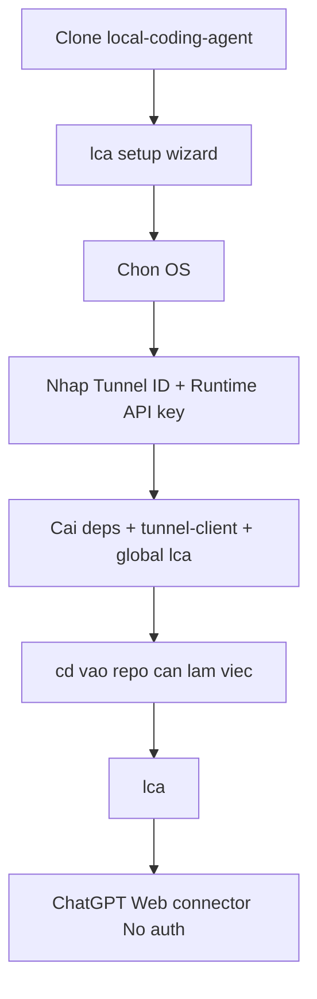

# AI Agent Setup Prompt

Copy prompt này vào Codex, Claude Code, Cursor hoặc agent local khác nếu muốn nó hỗ trợ cài repo này.

```text
Hãy cài Local Coding Agent theo flow TUI mới.

Repository:
https://github.com/luongduy2798/local-coding-agent

Mục tiêu:
- Clone repo nếu chưa có.
- Kiểm tra Node.js >= 18 và npm.
- Chạy setup wizard chính.
- Cài global command lca.
- Kiểm tra tôi có thể cd vào repo bất kỳ và chạy lca.

Quy tắc:
- Không commit secret, API key, Tunnel ID, .env.local, tools/ hoặc generated profiles.
- Không in giá trị secret ra màn hình.
- Không chạy lệnh destructive.
- Default mode=safe và policy=balanced.

Các bước:
1. Kiểm tra Node.js >= 18.
2. Clone repo nếu cần.
3. cd vào local-coding-agent.
4. Chạy setup wizard:
   - macOS/Linux/WSL: bash scripts/lca setup
   - Windows: scripts\lca.cmd setup
5. Khi wizard hỏi, để tôi nhập Tunnel ID và Runtime API key.
6. Kiểm tra command lca có trong PATH.
7. Hướng dẫn dùng:
   cd /path/to/repo
   lca
8. Báo lại health URL, workspace hiện tại, kết quả `lca status` và cách stop bằng `lca stop`.
```

## Setup Map



Chi tiết connector: [CHATGPT_WEB_CONNECTOR.md](CHATGPT_WEB_CONNECTOR.md).
