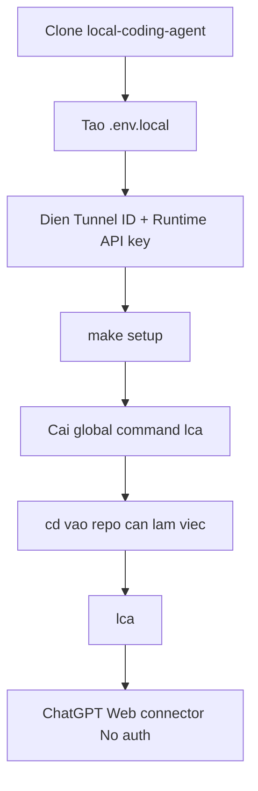

# AI Agent Setup Prompt

Copy prompt này vào Codex, Claude Code, Cursor hoặc agent local khác nếu muốn nó tự cài repo này.

```text
Hãy cài Local Coding Agent theo flow mới.

Repository:
https://github.com/LongNgn204/local-coding-agent

Mục tiêu:
- Clone repo nếu chưa có.
- Cài dependency.
- Tạo .env.local từ .env.example nếu chưa có.
- Hướng dẫn tôi điền CONTROL_PLANE_TUNNEL_ID và CONTROL_PLANE_API_KEY.
- Chạy make setup.
- Cài global command lca.
- Kiểm tra tôi có thể cd vào repo bất kỳ và chạy lca.

Quy tắc:
- Không commit secret, API key, Tunnel ID, .env.local, tools/ hoặc generated profiles.
- Không in giá trị secret ra màn hình.
- Không chạy lệnh destructive.
- Default mode=safe và policy=balanced.
- Không dùng scripts/lca setup/start làm flow chính nữa.
- Không dùng make run/make stop.

Các bước:
1. Kiểm tra Node.js >= 18.
2. Clone repo nếu cần.
3. cd vào local-coding-agent.
4. Nếu thiếu .env.local, chạy cp .env.example .env.local.
5. Chạy make keys để mở trang tạo Tunnel ID và Runtime API key.
6. Nhờ tôi điền CONTROL_PLANE_TUNNEL_ID và CONTROL_PLANE_API_KEY vào .env.local.
7. Chạy make setup.
8. Kiểm tra command lca có trong PATH.
9. Hướng dẫn dùng:
   cd /path/to/repo
   lca
10. Báo lại dashboard URL, health URL, workspace hiện tại và cách stop bằng lca stop.
```

## Setup Map



Chi tiết connector: [CHATGPT_WEB_CONNECTOR.md](CHATGPT_WEB_CONNECTOR.md).
