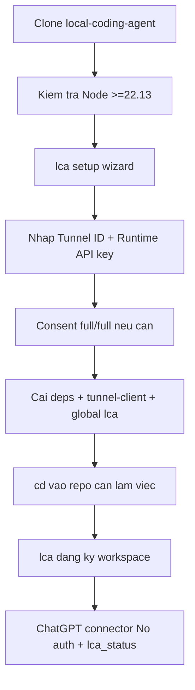

# AI Agent Setup Prompt

Copy prompt này vào Codex, Claude Code, Cursor hoặc agent local khác nếu muốn nó hỗ trợ cài repo này.

```text
Hãy cài Local Coding Agent theo flow TUI mới.

Repository:
https://github.com/luongduy2798/local-coding-agent

Mục tiêu:
- Clone repo nếu chưa có.
- Kiểm tra Node.js >= 22.13.0 và npm.
- Chạy setup wizard chính.
- Cài global command lca.
- Kiểm tra tôi có thể cd vào repo bất kỳ và chạy lca.
- Xác minh runtime fixed 36-tool catalog, advisory task orchestration và multi-workspace registry.

Quy tắc:
- Không commit secret, API key, Tunnel ID, .env.local, tools/ hoặc generated profiles.
- Không in giá trị secret ra màn hình.
- Không chạy lệnh destructive.
- Không âm thầm nâng config safe/balanced cũ lên full/full; để tôi xác nhận one-time consent.

Các bước:
1. Kiểm tra Node.js >= 22.13.0.
2. Clone repo nếu cần.
3. cd vào local-coding-agent.
4. Chạy setup wizard:
   - macOS/Linux/WSL: bash scripts/lca setup
   - Windows: scripts\lca.cmd setup
5. Khi wizard hỏi, để tôi nhập Tunnel ID và Runtime API key.
6. Kiểm tra command lca wrapper chạy được. Trên Windows, yêu cầu mở terminal mới trước khi dùng lệnh `lca` vì User PATH mới không áp dụng cho terminal đang mở.
7. Hướng dẫn dùng:
   cd /path/to/repo
   lca
8. Kiểm tra `lca workspace list`, public liveness `/healthz` và `lca status`;
   báo supervisor, server/tunnel readiness, selected workspace và cách stop bằng
   `lca stop`. Không kỳ vọng root/PID/task từ `/healthz`, không in instance nonce;
   `/healthz/details` chỉ dành cho local companion đã xác thực.
9. Hướng dẫn tạo ChatGPT connector với `No auth`, refresh connector nếu nó
   từng dùng legacy, mở chat mới và gọi `lca_status` để xác minh `catalog_version=7`.
```

## Setup Map



Chi tiết connector: [CHATGPT_WEB_CONNECTOR.md](CHATGPT_WEB_CONNECTOR.md).
